# UT2-TE1

## Índice

- [Instalación nativa NGINX](#instalación-nativa-nginx)
- [Instalación Docker](#instalación-docker)
- [Nginx + Docker](#nginx--docker)
- [Instalación PHP](#instalación-php)
- [Habilitar PHP en Nginx](#habilitar-php-en-nginx)
- [Aplicación PHP](#aplicación-php)
- [Calculadora Nativa](#calculadora-nativa)
- [Calculadora Dockerizada](#calculadora-dockerizada)
- [Aplicación Calculadora](#aplicación-calculadora)

---

## Instalación nativa NGINX
Para poder instalar Nginx vamos a descargarlo desde los repositorios oficiales de Nginx para obtener la última versión del programa.

### Realizamos sudo apt update:

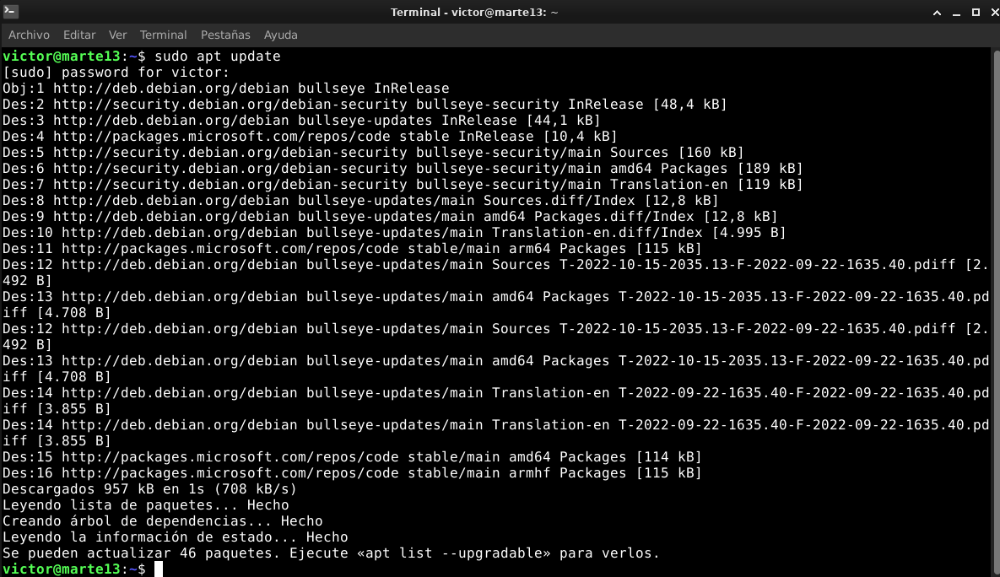

---

Añadimos algunos paquetes de soporte y ahora vamos a descargar y guardar la clave de firma de Nginx, pero tenemos primero que desarmarlo con gpg para poder acceder a ella.

### Descargamos los paquetes de soporte:

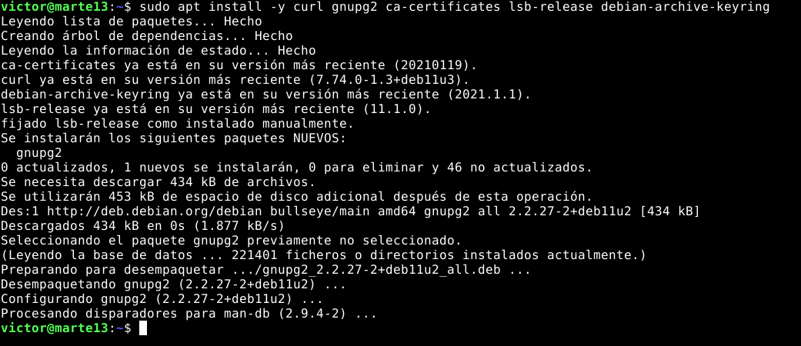

---

### Descarga, desarme y guardado de la clave de firma:

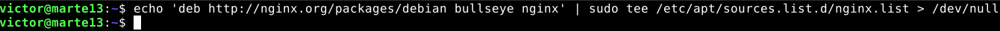

---

A continuación añadimos el repositorio oficial de Nginx para apt, asi luego podremos instalar la última versión de este.

### Añadimos el repositorio oficial para apt:

```
victor@marte13:~$ echo 'deb http://nginx.org/packages/debian bullseye nginx' \ | sudo tee /etc/apt/sources.list.d/nginx.list > /dev/null
```
---

### Instalar Nginx:

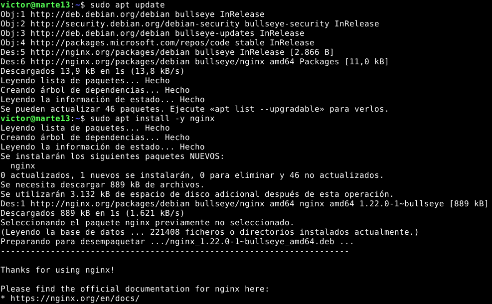

---

Tras completar la instalación comprobamos la versión de Nginx la cual la más reciente es *1.22.0*.

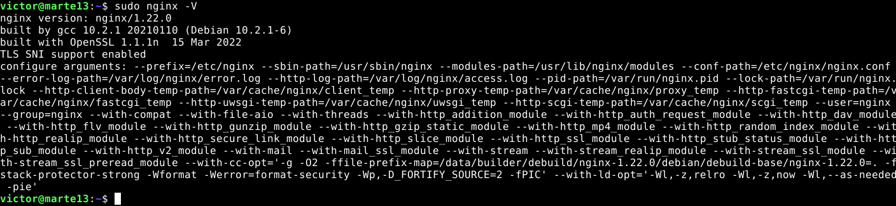

Luego de comprobar la versión, echamos un vistazo al servicio de Nginx mediante el comando:

`sudo systemctl status nginx`

El servicio nos aparece inactivo por lo tanto vamos a activarlo para poder empezar a trabajar.


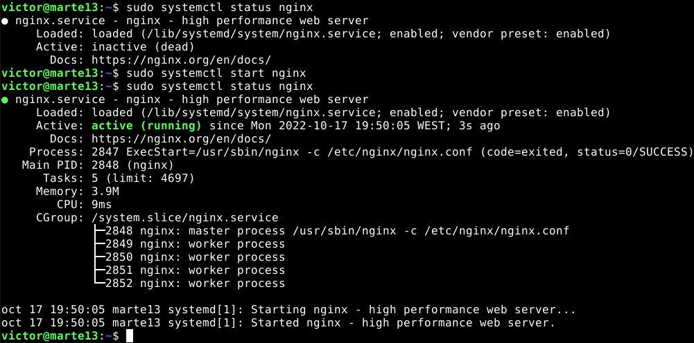


Como comprobación de que todo esta bien abrimos un navegador en mi caso abrire Firefox mediante linea de comando junto a la dirección que sera localhost (*127.0.0.1*). Esto abrirá la página de Nginx dandonos la bienvenida.


---

## Instalación Docker

Para poder tener una automatización del despliegue de nuestras futuras apliaciones web instalaremos Docker donde despliega aplicaciones dentro de contenedores de software y una de ellas es Nginx asi que instalaremos este programa.

Primero realizaremos un par de preparativos para la instalación del programa.

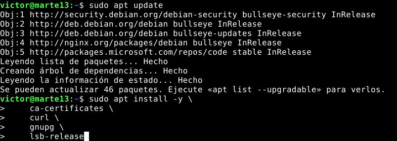

Tal y como hicimos anteriormente importamos la clave del repositorio externo de Docker y lo desarmamos para luego añadirlo a apt.

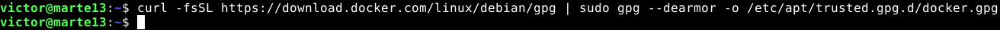

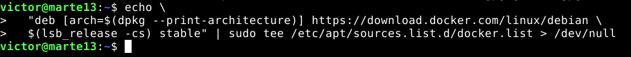

Tras realizar todo estos pasos solo debemos instalar Docker.

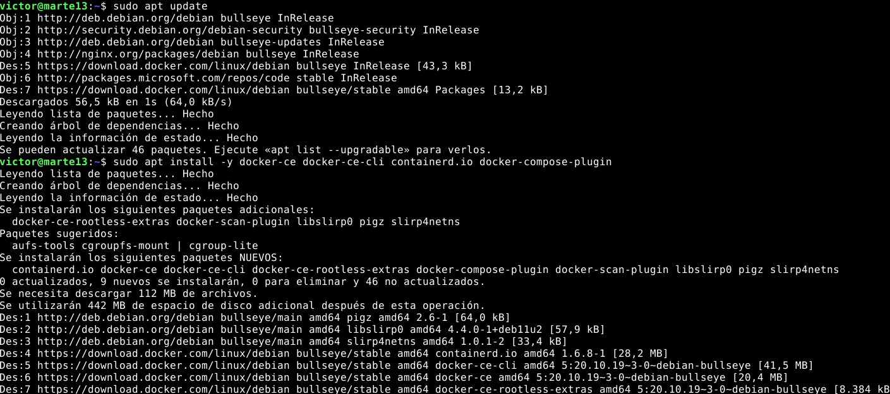


Perfecto, lo siguiente que tenemos que comprobar es la versión de Docker y el servicio esta activo y corriendo.

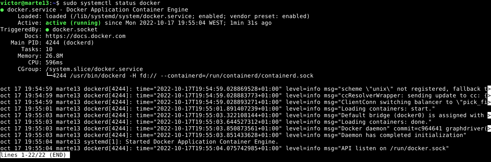

---

### Versión de Docker

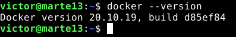

Para poder trabajar con Docker nos debemos incluir a nuestro usuario como privilegiado:

`victor@marte13:~$ sudo usermod -aG docker $USER`

Despues de probar Docker con el contenedor "Hello World" y saber cómo usarlo podemos empezar a usar Nginx y Docker.

---

## Nginx + Docker

Iniciaremos Docker con Nginx mediante el puerto 80 (*http*) del host con el puerto 80 del contenedor Docker, pero al activar Nginx anteriormente este puerto ya está en uso por lo tanto nos saltará ese error.

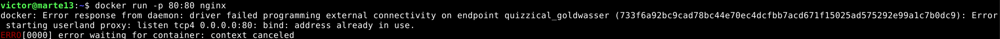

Asi que pararemos el servicio de Nginx:

`sudo systemctl stop nginx`

Y volvemos a iniciar el comando anterior:

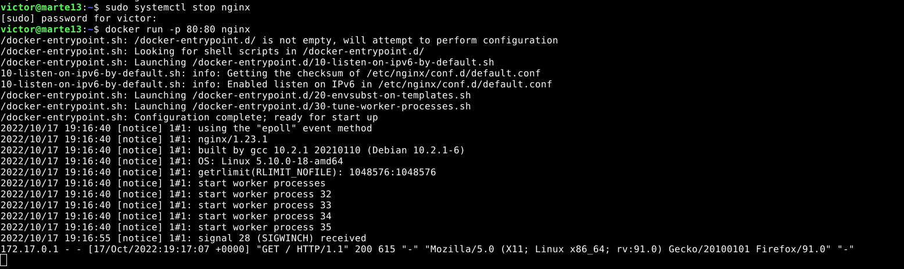

Al introducir el comando, docker descargará desde la libreria de Nginx los contenedores necesarios para su funcionamiento.
Si dejamos esta terminal iniciada y abrimos el localhost con nuestro navegador.

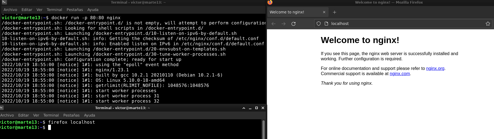

---

## Instalación PHP

Como ejemplo de despliegue de nuestras aplicaciones, usaremos PHP por lo tanto hay que instalarlo en nuestra máquina pero instalaremos la versión FPM de PHP ya que así manejará procesos *FastCGI*, un protocolo para interconectar programas interactivos con un servidor web.

Realizamos un *update* en nuestra máquina e instalaremos algunos repositorios que nos ayudarán posteriormente en la instalación de PHP.

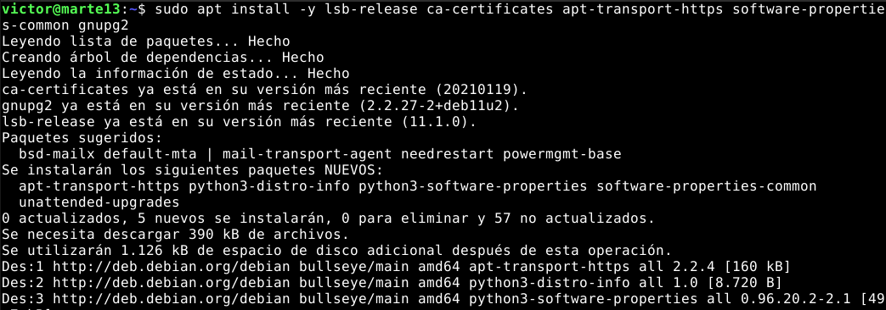

Luego añadimos, como anteriormente hemos hecho, el repositorio externo de PHP-FPM e importamos y desarmamos la clave GPG del repositorio.

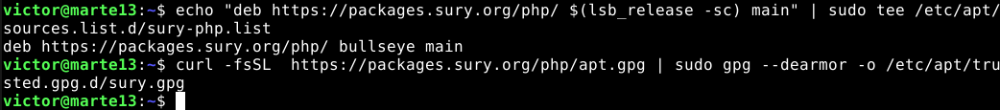

Actualizamos nuestra lista de repositorios y buscaremos la versión necesaria para nuestro proyecto. En este caso, la última versión de PHP-FPM, la *8.2*.

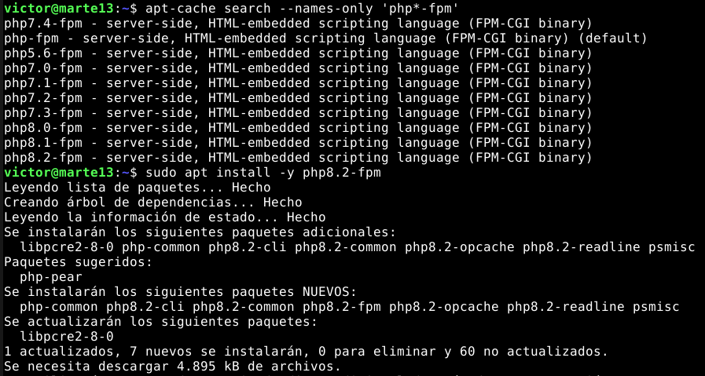

Tras completar la instalación comprobamos que el servicio de *PHP8.2-FPM* este activo.

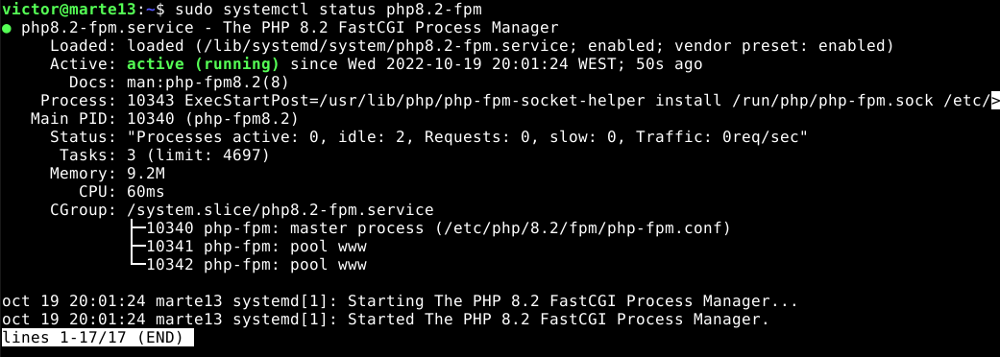

Y a continuación comprobamos que la versión de PHP sea la correcta.

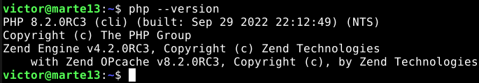

Por último, utilizaremos una instrucción de PHP para comprobar que funciona adecuadamente. En este caso nos devolverá el nombre de la máquina.

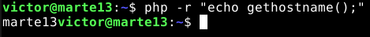

---

## Habilitar PHP en Nginx

Al Nginx no saber manejar código PHP u otros lenguajes, necesitamos que primero lo procese un servidor de aplicaciones como PHP-FPM.

Para que Nginx tenga acceso al socket de comunicación interprocesos (*Socket Unix*) que abre PHP-FPM,tenemos que editar la configuración de esta.

Abrimos la configuración de PHP-FPM y editamos para que el usuario nginx pueda acceder a PHP-FPM:

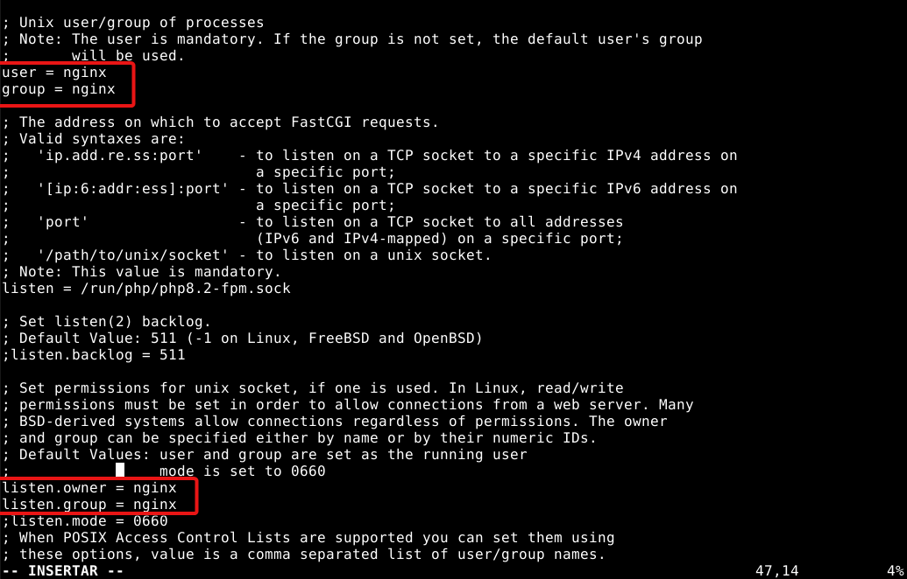

Para que haga efecto la configuración, recargamos el servicio PHP

`victor@marte13:~$ sudo systemctl reload php8.2-fpm`

Luego debemos habilitar la comunicación enter Nginx y PHP-FPM, por lo tanto editamos el siguiente archivo:

`victor@marte13:~$ sudo vi /etc/nginx/conf.d/default.conf`

Añadimos nuestro *home* para trabajar cómodamente al directorio `root`

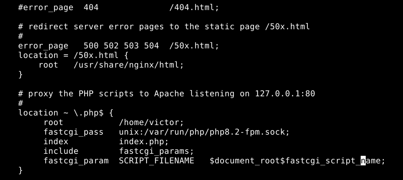

Para saber si la configuración es correcta, hacemos que Nginx realice un test con la configuración editada para comprobar errores de sintaxis.

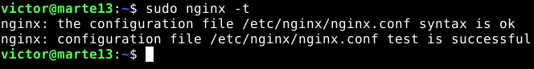

Si ha pasado los test, recargamos el servicio de Nginx:

`victor@marte13:~$ sudo systemctl reload nginx`

---
## Aplicación PHP

Antes de realizar nuestra aplicación de Calculadora, mostraremos la información sobre la versión de PHP que tenemos instalado.
Por lo tanto creamos una carpeta de trabajo *dev* y añadimos un el archivo info.php utilizado una línea de código básica.


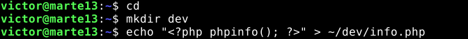

Luego creamos un enlace suave entre nuestro archivo info.php y la carpeta Nginx y probamos mediante un navegador e ir al *localhost* lo cual nos mostrará la información de la versión de PHP instalada en nuestro sistema.

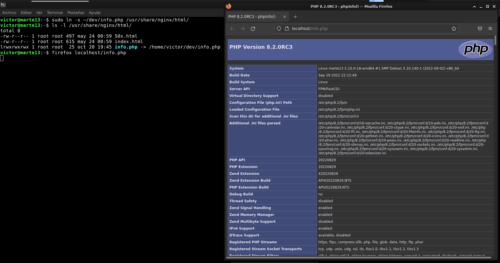

## Calculadora Nativa

Para que nuestra aplicación Calculadora sea nativa, tenemos que comprobar que el servicio de Nginx esta activo y crear un enlace suave entre la carpeta y la ruta de Nginx *(/usr/share/nginx/html/)* , ya que si lo hacemos al archivo PHP, Nginx no leerá los otros elementos como el CSS o las imagenes.

- Estructura de la Calculadora nativa

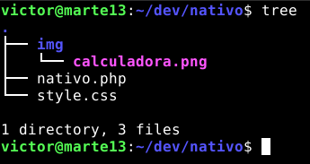

- Levantar el servicio Nginx:

`sudo systemctl start nginx`

- Crear el enlace:

`sudo ln -s ~/dev/nativo/ /usr/share/nginx/html/`

Por lo tanto tras crear el enlace, abrimos una terminal y con nuestro navegador para visualizar nuestra aplicación de calculadora:

`firefox localhost/nativo/nativo.php`

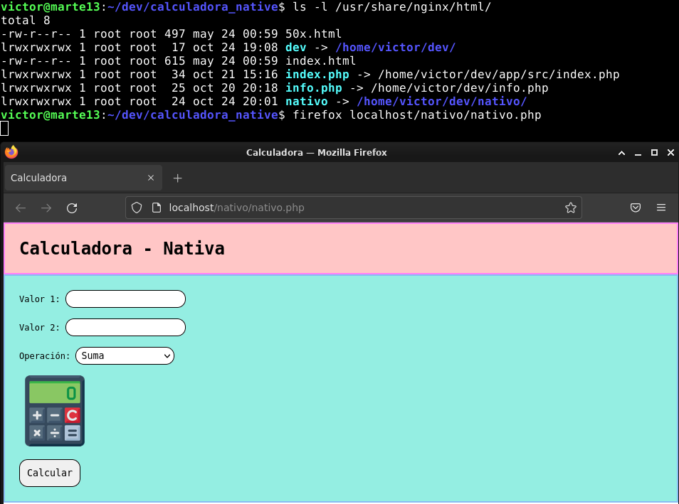

## Calculadora Dockerizada

Como primer paso crearemos la estructura de nuestra aplicación web con los siguientes archivos:
- default.conf
- docker-compose.yml
- src/aplicación

### docker-compose.yml
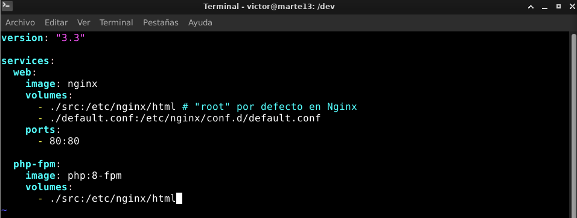

### default.conf

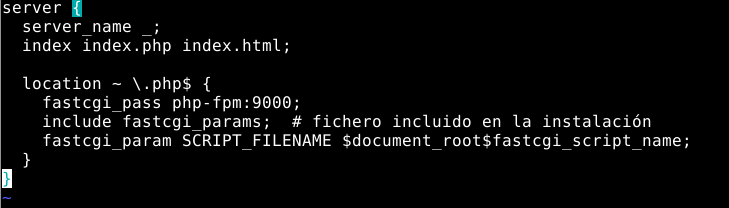

### src/aplicación

Dentro de src añadimos todos lo necesario para nuestra aplicación: PHP,CSS,Imágenes...
Con lo cual nos quedaríamos con la siguiente estructura:

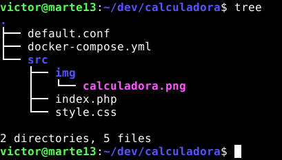


Ya con todo listo podemos levantar los servicios para nuestra aplicación:

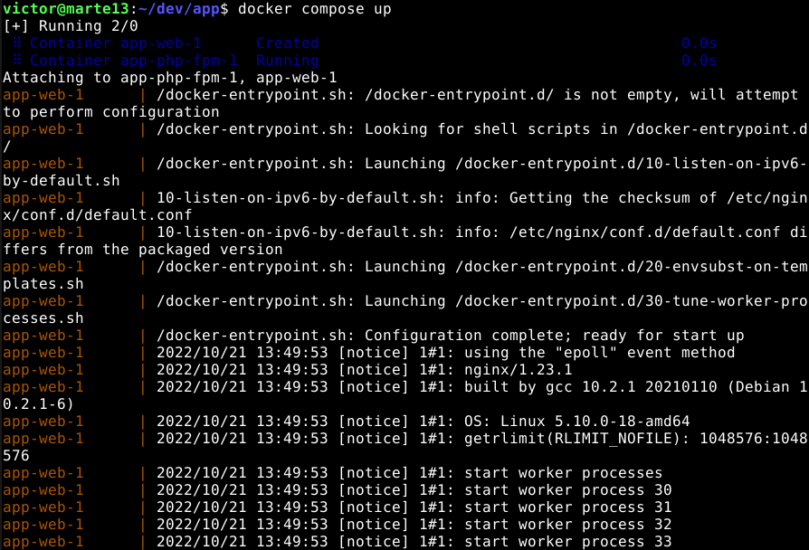

Con el `docker compose up` en funcionamiento, abrimos una nueva terminal y con nuestro navegador abrimos el *localhost* lo cual nos abrirá nuestra aplicación calculadora dockerizada.

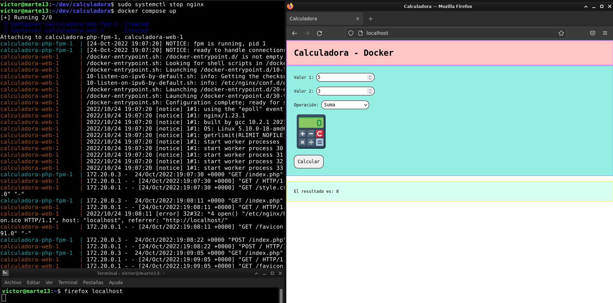


## Aplicación Calculadora

Para observar la estructura o el código de la aplicación Calculadora, elija aquí:

## Estructura

- [Nativa](Calculadora/nativo)

- [Dockerizada](Calculadora/dockerizada)

## Codigo 

- [Nativa](Calculadora/dockerizada/src/index.php)

- [Dockerizada](Calculadora/nativo/nativo.php)