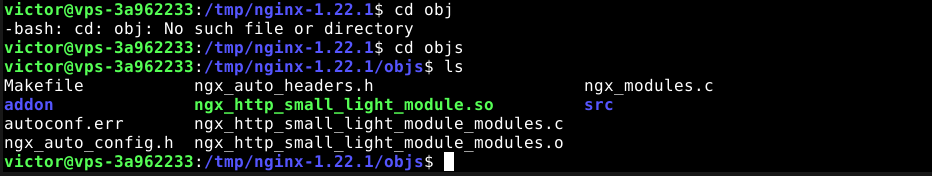
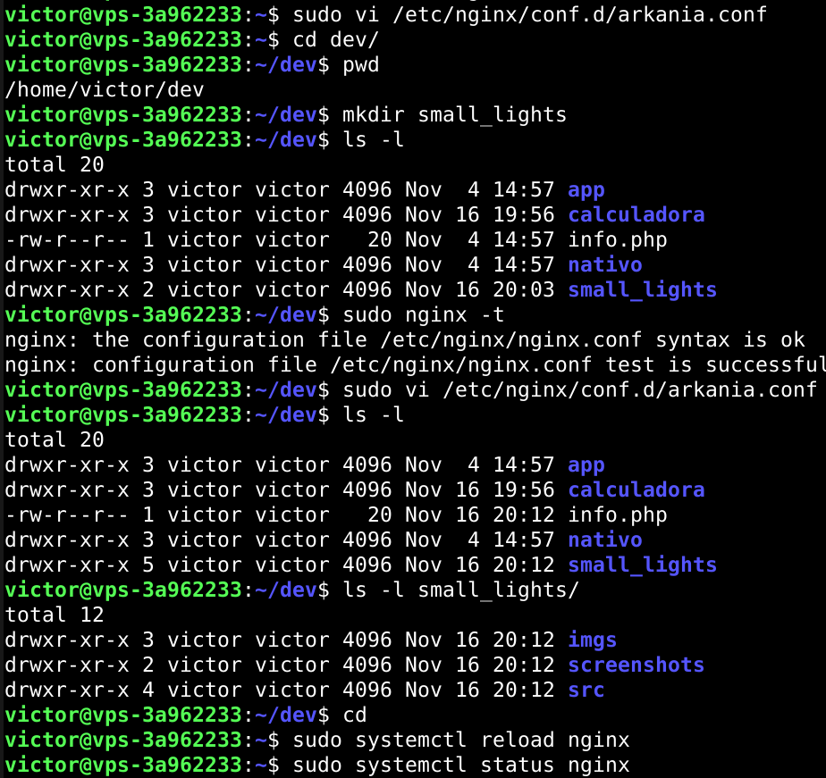

# UT3-TE1: Administración de servidores web

---

## Índice

- [Instalación y carga del módulo](#instalación-y-carga-del-módulo)
- [Creación del virtual host](#creación-del-virtual-host)
- [Implementación de la aplicación](#implementación-de-la-aplicación)
- [Certificado de seguridad](#certificado-de-seguridad)
- [Redirección www](#redirección-www)

---

## Instalación y carga del módulo

Realizaremos una instalación de un módulo y lo cargaremos dinámicamente en Nginx. Lo primero realizaremos unos preparativos en nuestro virtual host para que la instalación del módulo sea un éxito.

```
sudo apt update
sudo apt install gcc
sudo apt install libpcre3-dev
```

Instalamos el gcc para tener un compilador de C y las librerías de desarrollo de pcre, sino el proceso fallará

Tras realizar estas instalaciones comenzamos:

Primero descargamos el código fuente de Nginx y lo pondremos en la carpeta temporal. Tenemos que instalar la misma versión que tenemos instalado en el sistema


Luego descargamos el módulo de ngx_small_light, clonando el repositorio de este y añadiendolo a la carpeta temporal de la máquina


Tras completar estos pasos necesitaremos unas dependencias obligatorias para que el ngx_small_light funcione. Estas dependencias son:

- [PCRE](http://www.pcre.org/)
- [ImageMagick](http://www.imagemagick.org/script/index.php)
- [Imlib2 (opcional)](http://docs.enlightenment.org/api/imlib2/html/)
- [GD  (opcional)](https://bitbucket.org/)

Empezaremos instalando el PCRE, actualizmos los repositorios y lo instalamos:


---

Tras instalar PCRE, instalaremos el ImageMagick, clonamos el repositorio de esta dependencia:


---
Nos movemos a la carpeta de la dependencia y lanzamos el comando para configurarla:


---

Si lo intentamos compilar nuestro *virtual host* no tiene instalado el comando *make* por lo tanto lo instalaremos mediante el build-essentials  


Nos encontraremos con otro problema el cual es:

```
/bin/bash: ./libtool no such file or directory
```
Para solucionar este problema tuve que instalar libtool reconfigurar la dependencia y lanzar el comando:


---

Todo correcto. Ahora instalamos la dependencia sin problemas


---

Tras terminar la instalación, configurados el linkeado dinámico (*dynamic linker run-time bindings*) y probamos si funciona y efectivamente, todo funciona a la prefección.


Tenemos un problema al crear el módulo debido a que lo instalamos mediante una fuente source, por lo tanto, los siguientes pasos para desinstalar y luego instalar mediante repositorio, asi nuestro problema quedará resuelto.

El primer paso fue desinstalarlo con `sudo make uninstall` en la carpeta donde clone el repositorio para poder desinstralarlo y luego hicimos un `apt remove --purge` para quitar cualquier rastro de imagemagick en nuestro sistema junto con su configuración. Para finalizar instalamos el imagemagick y libmagickwand-dev para completar nuestra instalación.


Luego nos movemos a la carpeta del módulo anteriormente clonado en la carpeta */tmp* para generar la configuración. Luego nos vamos a la carpeta de nuestra versión de Nginx que descargamos antes también y configuramos el modulo para Nginx





## Creación del virtual host




images.alu6618.arkania
`scp -r -P2222 dev/ victor@alu6618.arkania.es:/home/victor/`

## Implementación de la aplicación
 
## Certificado de seguridad

## Redirección www