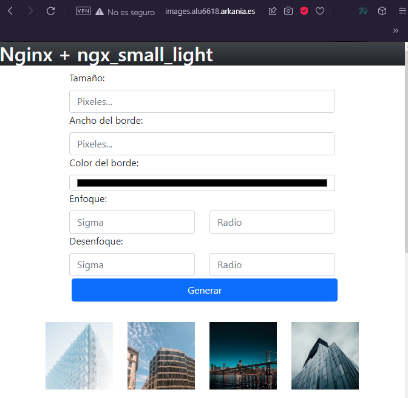
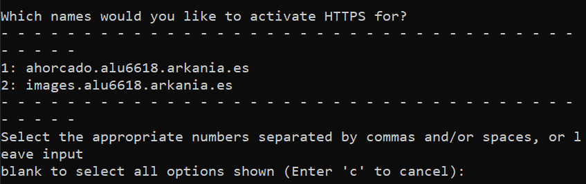
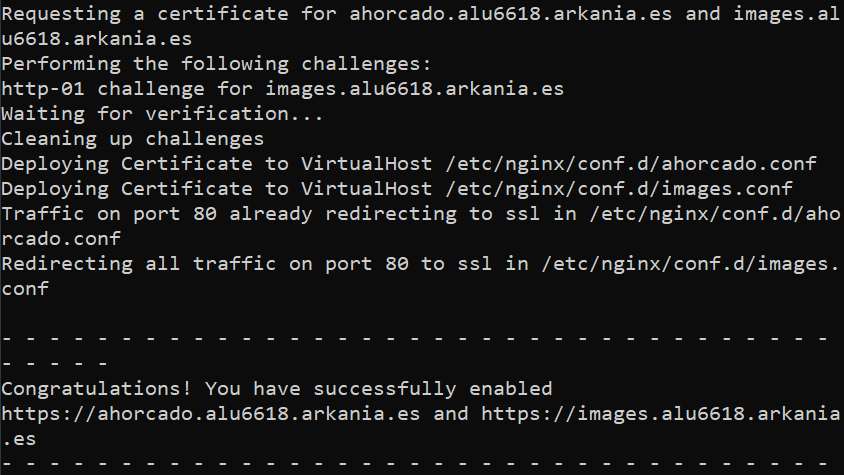

# UT3-TE1: Administración de servidores web


## Índice

- [Instalación y carga del módulo](#instalación-y-carga-del-módulo)
- [Creación del virtual host](#creación-del-virtual-host)
- [Implementación de la aplicación](#implementación-de-la-aplicación)
- [Certificado de seguridad](#certificado-de-seguridad)
- [Redirección www](#redirección-www)

---

## Instalación y carga del módulo

Realizaremos una instalación de un módulo y lo cargaremos dinámicamente en Nginx. Lo primero realizaremos unos preparativos en nuestro virtual host para que la instalación del módulo sea un éxito.

```
sudo apt update
sudo apt install gcc
sudo apt install libpcre3-dev
```

Instalamos el gcc para tener un compilador de C y las librerías de desarrollo de pcre, sino el proceso fallará

Tras realizar estas instalaciones comenzamos:

Primero descargamos el código fuente de Nginx y lo pondremos en la carpeta temporal. Tenemos que instalar la misma versión que tenemos instalado en el sistema


Luego descargamos el módulo de ngx_small_light, clonando el repositorio de este y añadiendolo a la carpeta temporal de la máquina


Tras completar estos pasos necesitaremos unas dependencias obligatorias para que el ngx_small_light funcione. Estas dependencias son:

- [PCRE](http://www.pcre.org/)
- [ImageMagick](http://www.imagemagick.org/script/index.php)

Empezaremos instalando el PCRE, actualizmos los repositorios y lo instalamos:


---

Tras instalar PCRE, instalaremos el ImageMagick, clonamos el repositorio de esta dependencia:


---
Nos movemos a la carpeta de la dependencia y lanzamos el comando para configurarla:


---

Si lo intentamos compilar nuestro *virtual host* no tiene instalado el comando *make* por lo tanto lo instalaremos mediante el build-essentials  


Nos encontraremos con otro problema el cual es:

```
/bin/bash: ./libtool no such file or directory
```
Para solucionar este problema tuve que instalar libtool reconfigurar la dependencia y lanzar el comando:


---

Todo correcto. Ahora instalamos la dependencia sin problemas


---

Tras terminar la instalación, configurados el linkeado dinámico (*dynamic linker run-time bindings*) y probamos si funciona y efectivamente, todo funciona a la prefección.


Tenemos un problema al crear el módulo debido a que lo instalamos mediante repositorio clonado y el comando *make*, por lo tanto, los siguientes pasos para desinstalar y luego instalar mediante repositorio, asi nuestro problema quedará resuelto.

El primer paso fue desinstalarlo con `sudo make uninstall` en la carpeta donde clone el repositorio para poder desinstralarlo y luego hicimos un `apt remove --purge` para quitar cualquier rastro de imagemagick en nuestro sistema junto con su configuración. Para finalizar instalamos el imagemagick y libmagickwand-dev para completar nuestra instalación.


Luego nos movemos a la carpeta del módulo anteriormente clonado en la carpeta */tmp* para generar la configuración. Luego nos vamos a la carpeta de nuestra versión de Nginx que descargamos antes también y configuramos el modulo para Nginx.


Cuando acabe de configurar el módulo utilizaremos *make modules* para crear el archivo que necesitamos para Nginx


Como podemos observar tenemos el archivo que queriamos el *ngx_http_small_light_module.so* entonces nuestro siguiente paso sera copiar este archivo a la carpeta donde se almacenan los módulos de Nginx


Añadimos la siguiente sentencia para cargar el módulo en Nginx.


Con esto hemos finalizado la instalación del módulo para nuestro proyecto de despliegue.

---

## Creación del virtual host

Para la creación de nuestro virtual host crearemos un nuevo .conf en la ruta */etc/nginx/conf.d/images.conf*. Aqui añadiremos solo el nombre de nuestra página y la ruta de nuestro proyecto la cual cargará el *index.html* por defecto. Tras guardar los cambios utilizamos el comando *sudo nginx -t* para comprobar elrecargamos el servicio de Nginx (*sudo systemctl reload nginx*)


Guardamos el fichero y acto seguido debemos de añadir esta dirección a fichero *etc/hosts* con la dirección del *localhost* y a continuación el nombre de nuestra página. 


Para probar si funcionaba añadi un *.html* simple con un título y como pueden ver funciona perfectamente.


Tras subir los archivos en los que hemos trabajado explicados en la [implementación de la aplicación](#implementación-de-la-aplicación) podemos ver nuestra página que se muestra perfectamente.



Para poder usar el módulo y que ya la página funcione perfectamente añadiremos un *location* en */etc/nginx/conf.d/images.conf* apuntando a la carpeta donde tenemos las imagenes(*/imgs*) y activando el módulo *small_light* y que pueda recibir los parámetros mediante el método GET por lo que nos permitirá usar el módulo mediante la URL de la imagen. Nuestro *images.conf* quedaría de la siguiente manera:


Para poder probar el módulo escogí una imagen aleatoria de la carpeta y añadí la estructura para modificar el tamaño de la imagen.


---

## Implementación de la aplicación

Para implementar la aplicación en nuestro virtual host primero creamos la carpeta *small_lights* y dentro la estructura de la aplicación sería:

- **src** - Almacenamos el código de la página.
- **imgs** - Almacenamiento de las imágenes que debemos mostrar

Crearemos primero la aplicación en local y luego la mandamos al host virtual.
La estructura aplicación debe ser de esta manera:


Para mandar la aplicación al host virtual, lo haremos mediante el comando *scp* en el cual detallaremos el puerto,el origen y el destino.


Una vez ya terminada la transferencia de archivos probamos nuestra aplicación en nuestro host virtual creado anteriormente [aqui](#creación-del-virtual-host) y como podemos ver todo marcha a la perfección.


---
 
## Certificado de seguridad

Tenemos que hacer que nuestra aplicación web sea segura para nuestros usuarios por ello le asignaremos un certificado de seguridad y usará el protocolo *https* lo cual haremos de nuestra página un sitio seguro.

Primero descargaremos e instalaremos certbot, un cliente de [*Let's Encrypt*](https://letsencrypt.org) que permite validar el dominio con facilidad.
Cuando termine de instalar comprobamos la versión para confirmar de que se ha instalado corretamente y luego para que funcione con Nginx debemos instalar el plugin para cerbot.


Todo listo para lanzar certbot y validar nuestros dominios. Nos pedirá unos algunos datos como el correo electrónico, aceptar términos de servicio y tu consentimiento de que te envien correos a tu email por primera vez.


Pero vamos a lo importante, certificar el dominio.
En este caso nos salen varios los cuales son nuestro proyecto actual con *ngx_small_light* y otro proyecto sobre el juego del ahorcado. Como queremos que ambos tengan la certificación no insertaremos ningún parámetro para que certifique todos los hosts virtuales que haya en la carpeta */nginx/conf.d/*.




Tras completar el proceso, certbot a modificado el *.conf* de los dominios que hemos seleccionado en los cuales podemos ver que ha añadido que el dominio escuche en el puerto 443 ssl lo cual indica que escuchará el puerto *https*


Para comprobarlo, primero reiniciamos el servicio de Nginx para cargar toda la configuración realizada y entramos a nuestra aplicación web.

Como podemos observar, tenemos el certificado emitido por *Let's Encrypt* a nuestro dominio


## Redirección www

Tenemos que redireccionar a los usuarios que entren en nuestra aplicación web mediante *www.* a nuestra aplicación con certificado de seguridad realizado por [cerbot](#certificado-de-seguridad). Primero tenemos que crear un *virtual host* aparte, insertando que escuche en el puerto 80  (*http*), que el nombre del servidor sea la url de nuestro servidor pero con a adición de *www.* y por ultima la redirección la cual retornaremos el código 301 para que nos redireccione a nuestra aplicación web con certificado de seguridad.


Ya creado el host virtual, le crearemos un certificado de seguridad para el subdominio ya que si no se lo crearemos nos saltará un error al no disponer de ello..


Por último reiniciamos el servicio de Nginx para cargar toda la configuración realizada y ya nos funciona la redirección


