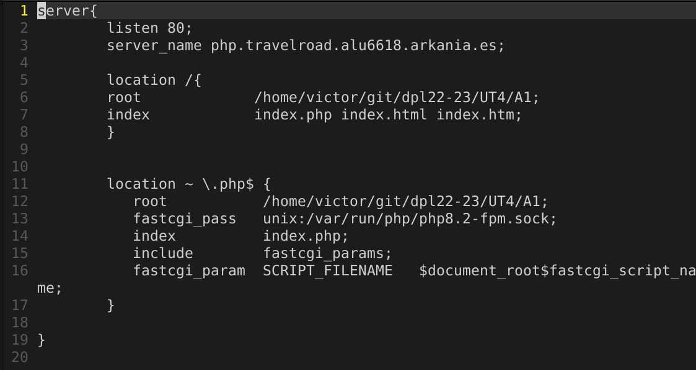
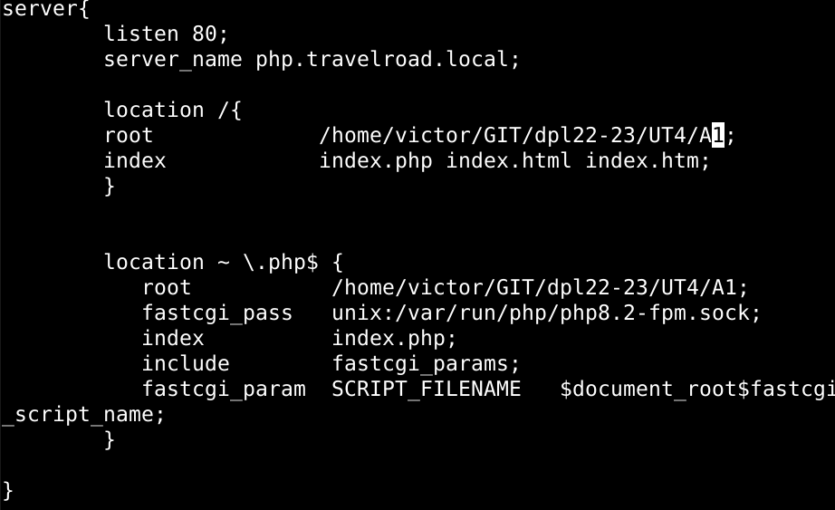
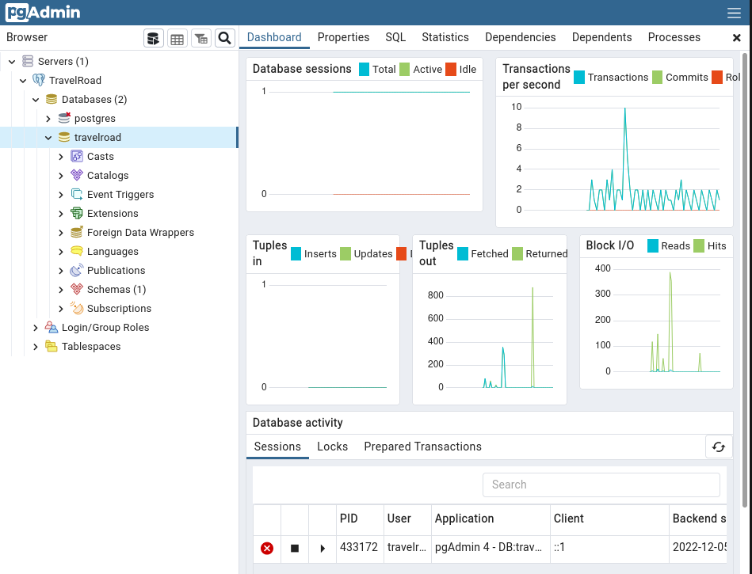
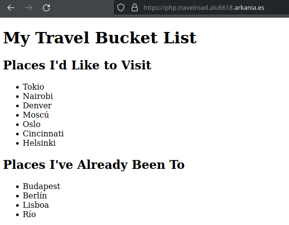

# UT4-TE1: Administración de servidores web (PostgreSQL)

## Indice

- [Instalación de PostgreSQL + Carga de datos](#instalación-de-postgresql--carga-de-datos)
- [Instalación de pgAdmin + Registro de servidor](#instalación-de-pgadmin--registro-de-servidor)
- [Aplicación PHP en desarrollo](#aplicación-php-en-desarrollo)
- [Aplicación PHP en producción](#aplicación-php-en-producción)
- [Despliegue](#despliegue)

---

## Instalación de PostgreSQL + Carga de datos

La instalación de PostgreSQL la tenemos que hacer tanto en desarrollo como en producción lo cual solo mostraré uno de ellos ya que el proceso es el mismo, por lo tanto, primero realizamos una actualización de los repositorios, instalamos algunos paquetes de soporte,descargamos la clave de firma para el repositorio oficial de PostgreSQL y añadimos el repositorio oficial de PostgreSQL en el sistema.


Actualizamos los repositorios de nuevo. Seguramente dispondremos de más de una versión, por lo tanto con el siguiente comando buscamos que versiones tenemos disponibles y descargamos la última.


Tras la instalación verificamos la que la versión que hemos añadido es la que nosotros deseamos y ,si todo ha ido bien, mostramos el estado del servicio de PostgreSQL


Entraremos a PostgreSQL con el siguiente comando y luego creamos un usuario con contraseña y la base de datos que utilizaremos en este ejercicio.


Salimos de PostgreSQL y volvemos a entrar pero esta vez con el usuario que hemos creado. Creamos la tabla *places* que nos será necesaria para nuestro ejercicio.


Una vez creada la tabla añadimos los datos a la base de datos mediante un archivo *.csv*


Cuando ya tengamos los datos cargados, tenemos que configurar PostgreSQL para que pueda "escuchar" desde cualquier IP ya que por defecto solo permite conexiones desde *localhost*. Para esto debemos modificar una linea específica en el archivo: ` /etc/postgresql/15/main/postgresql.conf `


Luego vamos a permitir el acceso del usuario anteriormente creado a la base de datos desde cualquier IP de origen. Para ello añadimos lo siguiente al final fichero de configuración (`/etc/postgresql/15/main/pg_hba.conf`) :


Tras realizar todas estas configuraciones, reiniciamos el servicio de PostgreSQL para que surtan efecto y comprobamos que ya esta escuchando todas las IPs.


El siguiente paso es crear la aplicación en desarrollo y un host virtual tanto en desarrollo como producción. En el caso de producción el nombre sera `php.travelroad.alu6618.arkania.es` y el de desarrollo `php.travelroad.local`.





Entraremos en el host virtual de desarrollo para probar la aplicación y la conexión con la base de datos de producción y ver que carga bien los datos. La aplicación es realizada en el entorno de desarrollo tal y como se explica [aquí](#aplicación-php-en-desarrollo).


---

## Instalación de pgAdmin + Registro de servidor

Para poder realizar la administación de PostgreSQL instalaremos **pgAdmin** pero antes instalaremos previamente **Python** en nuestro sistema, como se nos es indicado [aquí](https://github.com/sdelquin/pro/blob/main/ut0/python-install.md), para luego proceder con la instalación de pgAdmin.

Lo primero creamos las carpetas de trabajo con los permisos necesarios.


Luego, creamos un entorno virtual en Python e instalamos el paquete *pgadmin4*.  


Tras instalarlo nos pedir unos datos para, posteriormente, entrar a nuestra cuenta. 


Una vez terminemos, nos mostrará lo siguiente, lo cual debemos dejar corriendo, en caso contrario no funcionará pero de momento lo detendremos el proceso.


Para poderlo lanzar en modo producción y con garantías, usaremos un procesador de peticiones WSGI llamado *gunicorn*. Lo instalaremos como paquete Python y lo levantaremos


Pero no es ideal tener el proceso *gunicorn* funcionando en una terminal por lo tanto crearemos un servicio del sistema. Para ello creamos el siguiente archivo(`/etc/systemd/system/pgadmin.service`) con el contenido a continuación:


Recargamos todos los servicios e iniciamos el que acabamos de crear una vez vemos que esta activo, lo habilitamos en caso del reinicio del sistema.


Para finalizar creamos un host virtual en Nginx para que nos sirva como aplicación web.


Recargamos la configuración de Nginx y vamos a la URL especificada. Lo primero que encontraremos será una página de login la cual las credendenciales son las que anteriormente hemos insertado al lanzar pgadmin4, hemos insertado.

Email/Username: *victormanueltoa@gmail.com*

Password: dpldaw


Registramos el servidor con el nombre de nuestra base de datos.


Y añadimos los datos de nuestra base de datos indicando host, puerto, el nombre de la base de datos y la contraseña.


Cuando le demos a *Save* ya lo tenemos listo para administrar nuestra base de datos.



Por último añadimos el certificado al virtual host


---

## Aplicación PHP en desarrollo

Para desplegar nuestra aplicación primero debemos crearla en el entorno de desarrollo y luego llevarla a producción. Para ello nuestra aplicación de PHP debemos instalar el *php8.2-pgsql* para poder realizar la conexión con la base de datos por lo tanto lanzamos el siguiente comando:

`sudo apt install -y php8.2-pgsql`

Una vez instalado, empezamos a realizar nuestra aplicación la cual puede ver el código [aquí](./index.php). Luego tendremos que crear el archivo *config.php* donde insertamos las credenciales para acceder a la base de datos. Este archivo lo leeremos en nuestra aplicación mediante `require_once(<ruta del archivo>)` lo cual lee e importa el archivo dentro de nuestra aplicación para poder usar las variables de la base de datos que hemos definido previamente en el *config.php*


Ya una vez la aplicación completa, lo subiremos a nuestro repositorio de git para pasarlo a producción, excepto nuestro *config.php* eso lo mantendremos fuera de nuestro repositorio. Entonces realizaremos los siguientes comandos:

```
git add .
git commit -m "T4-A1 Aplicación finalizada"
```
Y para subirlo al repositorio simplemente hacemos un *git push*:


Ya subidos a nuestro repositorio usaremos el host virtual que hemos creado anteriormente llamado *php.travelroad.local*.


Y como hemos comprobado con anterioridad funciona perfectamente.


---

## Aplicación PHP en producción

Para poder traer nuestra aplicación a producción necesitaremos tener instalado *git*, asi que tras comprobar que lo tenemos instalado hacemos lo siguiente:


Tras terminar la clonación ya tenemos disponible nuestro repositorio con nuestra aplicación en ella.


Realizamos nuestro fichero *config.php* y lo mantendremos en nuestro home de nuestra máquina remota.


Con todo listo solo falta realizar el host virtual para nuestra aplicación asi que añadiremos lo siguiente a nuestro host virtual:


Una vez ya creado entramos a la URL indicada en el host virtual vemos que nos carga todo a la perfección.


Lo único que falta para terminar nuestra aplicación PHP en producción es la redirección *www* y el certificado.

Empezaremos por la redirección, lo que haremos será crear un virtual host aparte:


Este host virtual hará la redirección a nuestra página sin *www*. 

Pero para que pueda redireccionar a nuestra página con protocolo *https* tenemos que añadirle el certificado tanto a nuestro host virtual como a la redirección *www*.


Ya nuestro host virtual y su redirección han obtenido su certificado por lo tanto ambas funcionan ya, con protocolo *https*.




---

## Despliegue

Crearemos un script para actualizar el entorno de producción en el cual nos conectaremos por *ssh* al host virtual y nos moveremos a la carpeta donde tengamos guardado nuestra aplicación PHP y hacemos un *git pull*.

`ssh arkania 'cd /home/victor/git/dpl22-23/; git pull;' `

Para poder ejecutar el script le daremos permisos de ejecución:

`sudo chmod u+x deploy.sh`

Con nuestro script hecho, añadimos que nuestro programa imprima *"El script funciona"* mediante un *echo*. Ejecutamos nuestro script:


Ahora vamos a la página para comprobar que se ha hecho el pull correctamente y podemos ver que se ha actualizado bien nuestra aplicación.


---