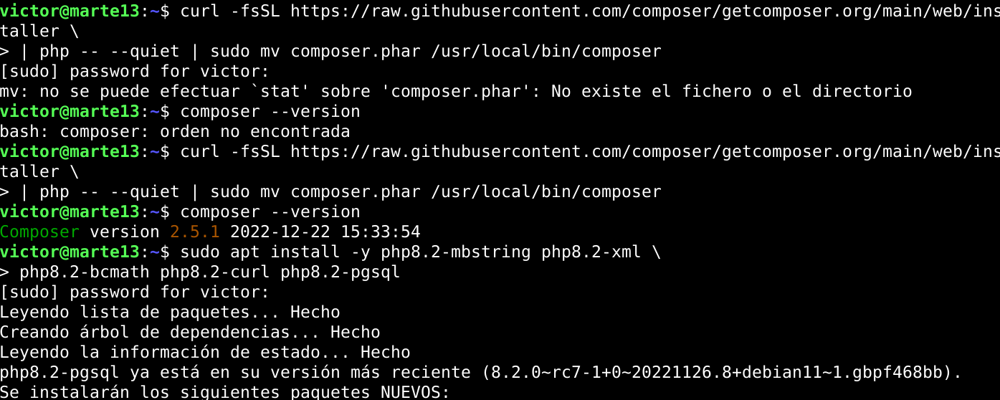
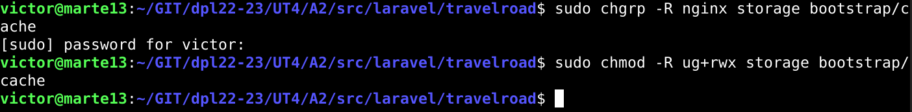
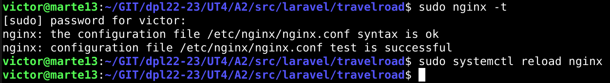

# UT4-TE2: Framework Web

## Indice

- [Laravel](#laravel)
- [Express](#express)
- [Spring](#spring)
- [Ruby on Rails](#ruby-on-rails)
- [Django](#django)

# Laravel

- [Instalación](#laravel-instalación)
- [Configuración Nginx](#laravel-configuración-nginx)
- [Lógica de Negocio](#laravel-lógica-de-negocio)
- [Depliegue](#laravel-depliegue)

## Laravel: Instalación

El primer framework web con el que interactuaremos sera Laravel, que esta orientado a desarrollar aplicaciones y servicios web con PHP.

El primer paso sera instalar el gestor de dependencias para PHP llamado **Composer**. Tras instalarlo comprobamos su version y luego, como necesitamos que ciertos módulos de PHP este habilitados en el sistema, instalamos algunos paquetes de soporte.

Ya con todo lo necesario podemos crear la estructura de la aplicación indicando que paquete queremos usar en este caso _laravel/laravel_. Una vez terminado podemos ver el _scaffolding_ o andamio para ya poder empezar a trabajar.

Comprobamos dentro de nuestra carpeta de trabajo si se ha instalado **Artisan**, la interfaz de línea de comandos de Laravel. Tras comprobarlo, durante el andamiaje de nuestra aplicación se ha creado un fichero de configuración _.env_ el cual abriremos y modificaremos ciertos valores para especificar las credenciales de acceso a la base de datos de PostgreSQL.

## Laravel: Configuración Nginx

Para nuestra configuración de Nginx,primero debemos fijar los permisos adecuados a los ficheros del proyecto para que los servicios tanto de Nginx como PHP-FPM puedan trabajar sin ningún tipo de problema.

Luego haremos la configuración del virtual host para nuestra aplicación.

Ya creada, comprobamos la sintaxis del archivo y si todo va bien, recargamos el servicio de Nginx y entramos a la URL de nuestra [aplicación](http://laravel.travelroad.alu6618.arkania.es/).

## Laravel: Lógica de Negocio

## Laravel: Depliegue

# Express

# Spring

# Ruby on Rails

# Django

---
