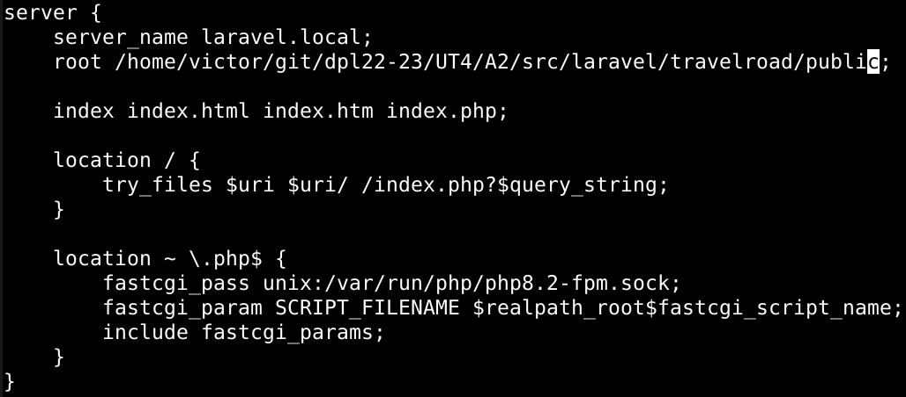

# UT4-TE2: Framework Web

## Indice

- [Laravel](#laravel)
- [Express](#express)
- [Spring](#spring)
- [Ruby on Rails](#ruby-on-rails)
- [Django](#django)

# Laravel

- [Instalación](#laravel-instalación)
- [Configuración Nginx](#laravel-configuración-nginx)
- [Lógica de Negocio](#laravel-lógica-de-negocio)
- [Depliegue](#laravel-depliegue)

## Laravel: Instalación

El primer framework web con el que interactuaremos sera Laravel, que esta orientado a desarrollar aplicaciones y servicios web con PHP.

El primer paso sera instalar el gestor de dependencias para PHP llamado **Composer**. Tras instalarlo comprobamos su version y luego, como necesitamos que ciertos módulos de PHP este habilitados en el sistema, instalamos algunos paquetes de soporte.

Ya con todo lo necesario podemos crear la estructura de la aplicación indicando que paquete queremos usar en este caso _laravel/laravel_. Una vez terminado podemos ver el _scaffolding_ o andamio para ya poder empezar a trabajar.

Comprobamos dentro de nuestra carpeta de trabajo si se ha instalado **Artisan**, la interfaz de línea de comandos de Laravel. Tras comprobarlo, durante el andamiaje de nuestra aplicación se ha creado un fichero de configuración _.env_ el cual abriremos y modificaremos ciertos valores para especificar las credenciales de acceso a la base de datos de PostgreSQL. En este caso haremos uno en desarrollo y otro en produccion.

### Config.env Desarrollo

### Config.env Produccion

## Laravel: Configuración Nginx

Para nuestra configuración de Nginx,primero debemos fijar los permisos adecuados a los ficheros del proyecto para que los servicios tanto de Nginx como PHP-FPM puedan trabajar sin ningún tipo de problema.

Luego haremos la configuración del virtual host para nuestra aplicación en producción y local.

Ya creada, comprobamos la sintaxis del archivo y si todo va bien, recargamos el servicio de Nginx y entramos a la URL de nuestra [aplicación](http://laravel.travelroad.alu6618.arkania.es/).

## Laravel: Lógica de Negocio

Nos quedaría cambiar el comportamiento de la aplicación para que cargue los datos y los muestre en una plantilla. En este caso tendremos que realizar una serie de pasos para que se nos muestre tal y como se pide.

Primero, dentro de nuestra aplicación, nos moveremos a la carpeta _routes_ y modificaremos el archivo **web.php** para que nos cargue los datos según en que página estemos.

Luego tenemos que realizar las plantillas que renderiza los datos. Nos moveremos a la carpeta `resources/views/travelroad.blade.php` y crearemos las plantillas, en este caso crearemos 3: El inicio (_travelroad_), lo que hemos visitado (_visited_) y lo que queremos visitar (_wished_).

Por lo tanto la estructura de carpetas nos quedaría como hemos editado en el archivo `routes/web.php`:

Si quieren echar un ojo al código lo pueden encontrar [aquí]()

Una vez terminado entraremos en el enlace de nuestra [aplicación](http://laravel.travelroad.alu6618.arkania.es/) para comprobar que todo esta bien.

## Laravel: Depliegue

Por último nos encargaremos del despligue, el cual lo subiremos a nuestro repositorio los cambios en la aplicación para luego desplegarla en producción. Lo primero, tendremos que confirmar que la carpeta _vendor_ esta incluida en el _.gitignore_ ya que este contiene todas las dependencias del proyecto.

Una vez comprobado, lo subimos a nuestro repositorio y descargamos nuestra aplicación en producción.

Para instalar de nuevo todas las dependencias debemos realizar el comando _composer install_ para que instale todas las dependencias.

Pero para automatizar esta tarea crearemos un script en local, el cual actualizará nuestra aplicación conectandose a producción, realizando un _pull_ desde nuestro repositorio e instala las dependencias.

`ssh arkania "cd ~/git/dpl22-23; git pull; cd /UT4/A2/src/laravel/travelroad; composer install;"`

# Express

El siguiente framework web a instalar será **Express**.

Nuestro primer paso será instalar **Node.js**, un entorno de ejecución de JavaScript, en nuestro equipo. Esta vez utilizaremos un instalador que nos facilita el añadir los repositorios oficiales de Node.js. 

Una vez añadidos los repositorios instalamos Node y cuando termine comprobamos la versión para ver si la instalación ha sido realizada con éxito.

Comenzaremos con andamiaje de nuestro proyecto lo cual usaremos una herramienta llamada *express-generator* que nos creará la estructura de nuestro poryecto.

Una vez instalado, creamos el andamio de nuestra aplicación con el motor de plantillas *Pug*

Como podemos ver, la estructura de nuestro proyecto ha sido creada en la carpeta *travelroad/* tal y como hemos indicado antes.

Antes de empezar debemos instalar las dependencias que estan guardadas en el *package.json* mediante el siguiente comando:

Ahora lanzamos la siguiente sentencia: `DEBUG=travelroad:* npm start`.
Esto nos permite probar nuestra aplicación tal y como nos indica en **localhost:3000**

Ahora necesitamos configurar la conexión a la base de datos de PostgreSQL por lo tanto añadimos una dependecia llamada *node-postgres*.

Luego para las credenciales de la base de datos necesitamos guardalas dentro de un archivo, por lo tanto instalaremos el paquete **dotenv** para poder leer los ficheros *.env*.

Ahora añadimos las credenciales de la base de datos a un archivo *.env* para realizar la conexión con PostgreSQL.

## Conexión base de datos

Ahora modificaremos la aplicación para que pueda cargar los datos y que los muestre en pantalla, por lo tanto primero creamos una carpeta *config* y dentro de este nuevo directorio, creamos el fichero *database.js* que nos conectará con la base de datos. 

## Rutas

Luego creamos un archivo en la carpeta *routes* llamado *index.js* en el cual requiere el archivo creado previamente para conectarse a la base de datos y realizar la consulta dependiendo en la ruta que estemos.

## Vistas

Tras esto creamos las vistas correspondientes en nuestro proyecto.

Y probamos nuestra aplicación en acción para ver si todo ha sido configurado correctamente.

Para gestionar los procesos de nuestra aplicación, haremos uso de **pm2** un gestor de procesos orientado a Node. Por lo tanto lo instalamos y lo ejecutamos en segundo plano en la carpeta de la aplicación. Si entramos en nuestro navegador y vamos a localhost:3000 podemos ver nuestra aplicación corriendo sin problemas.

Luego creamos nuestro host virtual en Nginx. En este caso los nombraremos *express.local* para nuestra máquina de **desarrollo** y *express.travelroad.alu6618.arkania.es* en **producción**

## Despliegue

# Spring

# Ruby on Rails

# Django

---
