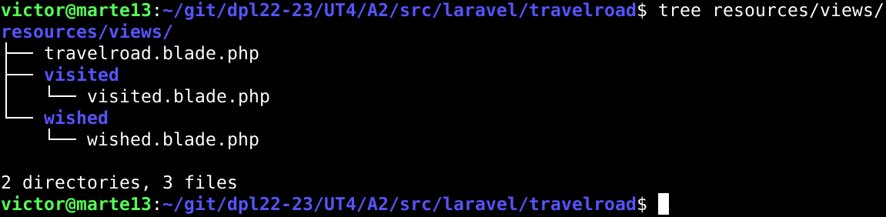
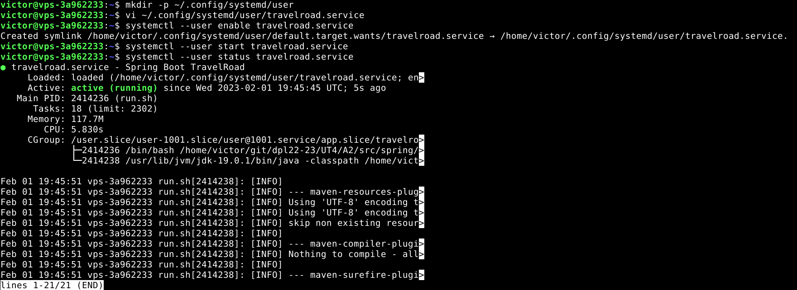
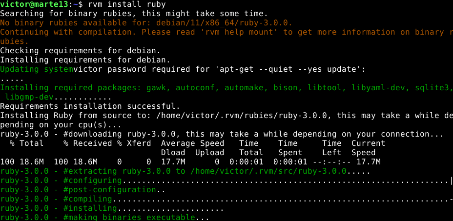
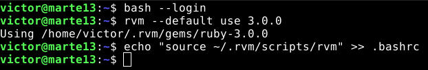

# UT4-TE2: Framework Web

## Indice

- [Laravel](#laravel)
- [Express](#express)
- [Spring](#spring)
- [Ruby on Rails](#ruby-on-rails)
- [Django](#django)

# Laravel

- [Instalación](#laravel-instalación)
- [Configuración Nginx](#laravel-configuración-nginx)
- [Lógica de Negocio](#laravel-lógica-de-negocio)
- [Depliegue](#laravel-depliegue)
- [Aplicación Desplegada](#laravel-aplicación)

## Laravel: Instalación

El primer framework web con el que interactuaremos sera Laravel, que esta orientado a desarrollar aplicaciones y servicios web con PHP.

El primer paso sera instalar el gestor de dependencias para PHP llamado **Composer**. Tras instalarlo comprobamos su version y luego, como necesitamos que ciertos módulos de PHP este habilitados en el sistema, instalamos algunos paquetes de soporte.


Ya con todo lo necesario podemos crear la estructura de la aplicación indicando que paquete queremos usar en este caso _laravel/laravel_. Una vez terminado podemos ver el _scaffolding_ o andamio para ya poder empezar a trabajar.


Comprobamos dentro de nuestra carpeta de trabajo si se ha instalado **Artisan**, la interfaz de línea de comandos de Laravel. Tras comprobarlo, durante el andamiaje de nuestra aplicación se ha creado un fichero de configuración _.env_ el cual abriremos y modificaremos ciertos valores para especificar las credenciales de acceso a la base de datos de PostgreSQL. En este caso haremos uno en desarrollo y otro en produccion.


### Config.env Desarrollo


### Config.env Produccion


## Laravel: Configuración Nginx

Para nuestra configuración de Nginx,primero debemos fijar los permisos adecuados a los ficheros del proyecto para que los servicios tanto de Nginx como PHP-FPM puedan trabajar sin ningún tipo de problema.


Luego haremos la configuración del virtual host para nuestra aplicación en producción y local.


Ya creada, comprobamos la sintaxis del archivo y si todo va bien, recargamos el servicio de Nginx y entramos a la URL de nuestra [aplicación](http://laravel.travelroad.alu6618.arkania.es/).


## Laravel: Lógica de Negocio

Nos quedaría cambiar el comportamiento de la aplicación para que cargue los datos y los muestre en una plantilla. En este caso tendremos que realizar una serie de pasos para que se nos muestre tal y como se pide.

Primero, dentro de nuestra aplicación, nos moveremos a la carpeta _routes_ y modificaremos el archivo **web.php** para que nos cargue los datos según en que página estemos.


Luego tenemos que realizar las plantillas que renderiza los datos. Nos moveremos a la carpeta `resources/views/travelroad.blade.php` y crearemos las plantillas, en este caso crearemos 3: El inicio (_travelroad_), lo que hemos visitado (_visited_) y lo que queremos visitar (_wished_).

Por lo tanto la estructura de carpetas nos quedaría como hemos editado en el archivo `routes/web.php`:



Si quieren echar un ojo al código lo pueden encontrar [aquí]()

Una vez terminado entraremos en el enlace de nuestra aplicación para comprobar que todo esta bien.


Lo último que faltaría es, validar nuestra página mediante **Certbot**:


Y ya tendremos nuestra página certificada


## Laravel: Depliegue

Por último nos encargaremos del despligue, el cual lo subiremos a nuestro repositorio los cambios en la aplicación para luego desplegarla en producción. Lo primero, tendremos que confirmar que la carpeta _vendor_ esta incluida en el _.gitignore_ ya que este contiene todas las dependencias del proyecto.


Una vez comprobado, lo subimos a nuestro repositorio y descargamos nuestra aplicación en producción.


Para instalar de nuevo todas las dependencias debemos realizar el comando _composer install_ para que instale todas las dependencias.


Pero para automatizar esta tarea crearemos un script en local, el cual actualizará nuestra aplicación conectandose a producción, realizando un _pull_ desde nuestro repositorio e instala las dependencias.

`ssh arkania "cd $(dirname $0)/git/dpl22-23; git pull; cd /UT4/A2/src/laravel/travelroad; composer install;"`

## Laravel: Aplicación

[Travel Road - Laravel](https://laravel.travelroad.alu6618.arkania.es/)

# Express

## Express - Indice

- [Instalación](#express---instalación)
- [Conexión a Base de Datos](#express---conexión-base-de-datos)
- [Rutas](#express---rutas)
- [Vistas](#express---vistas)
- [Despliegue](#express---despliegue)
- [Aplicación](#express---aplicación)

## Express - Instalación

El siguiente framework web a instalar será **Express**.

Nuestro primer paso será instalar **Node.js**, un entorno de ejecución de JavaScript, en nuestro equipo. Esta vez utilizaremos un instalador que nos facilita el añadir los repositorios oficiales de Node.js.


Una vez añadidos los repositorios instalamos Node y cuando termine comprobamos la versión para ver si la instalación ha sido realizada con éxito.


Comenzaremos con andamiaje de nuestro proyecto lo cual usaremos una herramienta llamada _express-generator_ que nos creará la estructura de nuestro poryecto.


Una vez instalado, creamos el andamio de nuestra aplicación con el motor de plantillas _Pug_


Como podemos ver, la estructura de nuestro proyecto ha sido creada en la carpeta _travelroad/_ tal y como hemos indicado antes.


Antes de empezar debemos instalar las dependencias que estan guardadas en el _package.json_ mediante el siguiente comando:


Ahora lanzamos la siguiente sentencia: `DEBUG=travelroad:* npm start`.
Esto nos permite probar nuestra aplicación tal y como nos indica en **localhost:3000**


Ahora necesitamos configurar la conexión a la base de datos de PostgreSQL por lo tanto añadimos una dependecia llamada _node-postgres_.


Luego para las credenciales de la base de datos necesitamos guardalas dentro de un archivo, por lo tanto instalaremos el paquete **dotenv** para poder leer los ficheros _.env_.


Ahora añadimos las credenciales de la base de datos a un archivo _.env_ para realizar la conexión con PostgreSQL.


## Express - Conexión base de datos

Ahora modificaremos la aplicación para que pueda cargar los datos y que los muestre en pantalla, por lo tanto primero creamos una carpeta _config_ y dentro de este nuevo directorio, creamos el fichero _database.js_ que nos conectará con la base de datos.


## Express - Rutas

Luego creamos un archivo en la carpeta _routes_ llamado _index.js_ en el cual requiere el archivo creado previamente para conectarse a la base de datos y realizar la consulta dependiendo en la ruta que estemos.


## Express - Vistas

Tras esto creamos las vistas correspondientes en nuestro proyecto.


Y probamos nuestra aplicación en acción para ver si todo ha sido configurado correctamente.


Para gestionar los procesos de nuestra aplicación, haremos uso de **pm2** un gestor de procesos orientado a Node. Por lo tanto lo instalamos y lo ejecutamos en segundo plano en la carpeta de la aplicación. Si entramos en nuestro navegador y vamos a localhost:3000 podemos ver nuestra aplicación corriendo sin problemas.


Luego creamos nuestro host virtual en Nginx. En este caso los nombraremos _express.local_ para nuestra máquina de **desarrollo** y _express.travelroad.alu6618.arkania.es_ en **producción**


Con todo configurado pasaremos nuestra aplicación por **Certbot** para que valide nuestra página:


Y tras esto nuestra aplicación web ya tiene certificado:


## Express - Despliegue

Como en el framework anterior crearemos un script de despliegue en local para que se actualice nuestra aplicación en producción, este lo que hará será actualizar, si no tiene las dependencias instalarlas con _npm install_ y reiniciar el gestor de procesos **pm2**.

`ssh arkania "cd $(dirname $0)/git/dpl22-23; git pull; cd /UT4/A2/src/express/travelroad; npm install; pm2 restart travelroad --update-env;"`

## Express - Aplicación:

[Travel Road - Express](https://express.travelroad.alu6618.arkania.es/)

# Spring

## Spring - Indice

- [Instalación](#spring---instalación)
- [Creación del Proyecto](#spring---creación-proyecto)
- [Compilación](#spring---compilación)
- [Despliegue](#spring---despliegue)
- [Aplicación](#spring---aplicación)

## Spring - Instalación

El siguiente framework a trabajar será **Spring** orientado a aplicaciones y webs basadas en **Java**.

Necesitaremos el **JDK** _(Java Development Kit)_ o en su defecto la versión _open source_ llamada **OpenJDK**. Lo descargaremos desde la página oficial de OpenJDK y lo enviamos a la carpeta temporal.


Una vez descargado lo descomprimimos en la carpeta _/usr/lib/jvm_


Comprobamos que todo ha sido descomprimido correctamente.


Para que el OpenJDK funcione correctamente debemos realizar dos pasos, primero, establecer variables de entorno en _/etc/profile.d/jdk_home.sh_ indicando donde se encuentran los ejecutables de Java y segundo, actualizar las alternativas de los ejecutables los cuales son _java_, la herramienta para ejecutar los programas hechos en Java y _javac_, el compilador de Java.


Una vez hecho, comprobamos las versiones de Java y Javac que tenemos instaladas. Si todo fue bien, cerraremos y abriremos de nuevo la sesión de usuario para que los cambios se apliquen.


### SDKMAN

Nuestro siguiente paso será instalar **SDKMAN**, una herramienta que permite gestionar versiones de kits de desarrollo de software en los cuales está incluido Java. Para ello primero instalaremos **.zip**


Luego ejecutamos el siguiente script, para realizar la instalación de SDKMAN


Activamos el punto de entrada para la herramienta y si no ha dado ningún problema, comprobamos la versión para afirmar que se ha instalado correctamente.


Ahora con **SDKMAN** instalaremos dos herramientas importantes para nuestro proyecto. **SpringBoot** una herramienta que facilita la preparación de aplicaciones Spring para producción y **Maven** el cual sería el constructor de proyectos y el que permite la gestión de las dependencias.

### SpringBoot


### Maven


---

## Spring - Creación Proyecto

Con todo instalado, empezamos a crear el proyecto como los anteriores frameworks, primero la estructura la cual la realizaremos con **SpringBoot** y usará **Maven** para las dependencias y construir la aplicación.


Ahora dentro de la carpeta _src/main_ organizaremos los distintos módulos los cuales son el **Modelo,Controlador y las Plantillas**. Por lo tanto creamos las carpetas y los archivos correspondientes para luego configurarlos


Primero empezaremos por el **Controlador** el cual se alojará en el archivo _HomeController.java_. Será el encargado en solicitar los datos que necesitaremos de la base de datos a nuestra aplicación.


Lo siguiente será el **Modelo**, la cual realizaremos la clase _Place_ donde se guardará el nombre del sitio y un booleano el cual nos indicará si ha sido visitado o no y los métodos que nos ayudarán a modificar o conseguir estos datos.


Luego en la carpeta _/repositories_, el archivo _PlaceRepository.java_ realizará la consulta de seleccionar todo aquellos lugares los cuales se han o no visitado y devolverá una lista con objetos de la clase _Place_.


Lo que quedaría sería realizar las plantillas, el cual utilizaremos un motor moderno de plantillas llamado _Thyleaf_. Por lo tanto crearemos 3 plantillas: home,visited,wished.

### Home


### Visited


### Wished


Por último, creamos las credenciales para que nuestra aplicación pueda conectarse a nuestra base de datos.

### Desarrollo


### Producción


## Spring - Compilación

Para poner en funcionamiento nuestra aplicación, en nuestra carpeta de proyecto lanzamos el comando `./mvnw package` y el resultado será un _.jar_


Para lanzar la aplicación lanzaremos el _.jar_ generado `java -jar target/travelroad-0.0.1-SNAPSHOT.jar` en el cual podremos acceder en la dirección _localhost:8080_ y probar la aplicación, pero crearemos un script para que realice los pasos del proceso de construcción.


Le asignamos permisos de ejecución al script y creamos un fichero de servicio pero para usuario asi podremos desplegarlo más adelante:


Recargamos todos los servicios, activamos nuestro nuevo servicio y lo habilitamos para que cuando reiniciemos el equipo, el servicio se active automáticamente.



Cuando tengamos todo listo realizamos el host virtual en Nginx tanto en desarrollo como en producción.

### Desarrollo


### Producción


Y la tras comprobar la sintaxis y recargar el servicio Nginx probamos nuestra aplicación.


Ahora como último paso utilizamos Certbot para que nuestra aplicación este certificada.


## Spring - Despliegue

Para desplegar nuestra aplicación usaremos un _script_ llamado **deploySpring.sh** al cual le pasaremos los siguientes comandos:

```
#!/bin/bash

ssh arkania "
  cd $(dirname $0)/git/dpl22-23
  git pull
  systemctl --user restart travelroad.service
"
```

Le damos permisos de ejecución y lo probamos

## Spring - Aplicación

[Travel Road - Spring](https://spring.travelroad.alu6618.arkania.es/)

# Ruby on Rails






/home/victor/.rvm/gems/ruby-3.0.0/gems/passenger-6.0.17


# Django


---
