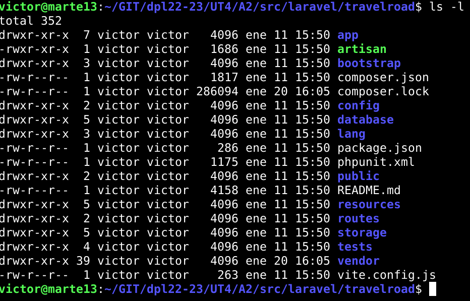
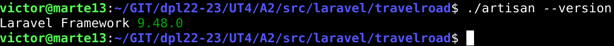

# UT4-TE2: Framework Web

## Indice

- [Laravel](#laravel)
- [Express](#express)
- [Spring](#spring)
- [Ruby on Rails](#ruby-on-rails)
- [Django](#django)

# Laravel

- [Instalación](#laravel-instalación)
- [Configuración Nginx](#laravel-configuración-nginx)
- [Lógica de Negocio](#laravel-lógica-de-negocio)
- [Depliegue](#laravel-depliegue)

## Laravel: Instalación

El primer framework web con el que interactuaremos sera Laravel, que esta orientado a desarrollar aplicaciones y servicios web con PHP.

El primer paso sera instalar el gestor de dependencias para PHP llamado **Composer**. Tras instalarlo comprobamos su version y luego, como necesitamos que ciertos módulos de PHP este habilitados en el sistema, instalamos algunos paquetes de soporte.

Ya con todo lo necesario podemos crear la estructura de la aplicación indicando que paquete queremos usar en este caso _laravel/laravel_. Una vez terminado podemos ver el _scaffolding_ o andamio para ya poder empezar a trabajar.

Comprobamos dentro de nuestra carpeta de trabajo si se ha instalado **Artisan**, la interfaz de línea de comandos de Laravel. Tras comprobarlo, durante el andamiaje de nuestra aplicación se ha creado un fichero de configuración _.env_ el cual abriremos y modificaremos ciertos valores para especificar las credenciales de acceso a la base de datos de PostgreSQL. En este caso haremos uno en desarrollo y otro en produccion.

### Config.env Desarrollo

### Config.env Produccion

## Laravel: Configuración Nginx

Para nuestra configuración de Nginx,primero debemos fijar los permisos adecuados a los ficheros del proyecto para que los servicios tanto de Nginx como PHP-FPM puedan trabajar sin ningún tipo de problema.

Luego haremos la configuración del virtual host para nuestra aplicación en producción y local.

Ya creada, comprobamos la sintaxis del archivo y si todo va bien, recargamos el servicio de Nginx y entramos a la URL de nuestra [aplicación](http://laravel.travelroad.alu6618.arkania.es/).

## Laravel: Lógica de Negocio

Nos quedaría cambiar el comportamiento de la aplicación para que cargue los datos y los muestre en una plantilla. En este caso tendremos que realizar una serie de pasos para que se nos muestre tal y como se pide.

Primero, dentro de nuestra aplicación, nos moveremos a la carpeta _routes_ y modificaremos el archivo **web.php** para que nos cargue los datos según en que página estemos.

Luego tenemos que realizar las plantillas que renderiza los datos. Nos moveremos a la carpeta `resources/views/travelroad.blade.php` y crearemos las plantillas, en este caso crearemos 3: El inicio (_travelroad_), lo que hemos visitado (_visited_) y lo que queremos visitar (_wished_).

Por lo tanto la estructura de carpetas nos quedaría como hemos editado en el archivo `routes/web.php`:

Si quieren echar un ojo al código lo pueden encontrar [aquí]()

Una vez terminado entraremos en el enlace de nuestra [aplicación](http://laravel.travelroad.alu6618.arkania.es/) para comprobar que todo esta bien.

## Laravel: Depliegue

Por último nos encargaremos del despligue, el cual lo subiremos a nuestro repositorio los cambios en la aplicación para luego desplegarla en producción. Lo primero, tendremos que confirmar que la carpeta _vendor_ esta incluida en el _.gitignore_ ya que este contiene todas las dependencias del proyecto.

Una vez comprobado, lo subimos a nuestro repositorio y descargamos nuestra aplicación en producción.

Para instalar de nuevo todas las dependencias debemos realizar el comando _composer install_ para que instale todas las dependencias.

Pero para automatizar esta tarea crearemos un script en local, el cual actualizará nuestra aplicación conectandose a producción, realizando un _pull_ desde nuestro repositorio e instala las dependencias.

`ssh arkania "cd ~/git/dpl22-23/UT4/A2/src/laravel/travelroad; git pull; composer install;"`

# Express

APP_NAME=TravelRoad
APP_ENV=production
APP_KEY=base64:NG+Gqg3aLcXGcF+sCce8JdpsORVKgAQD/eLaSx+cXiw=
APP_DEBUG=true
APP_URL=http://localhost

LOG_CHANNEL=stack
LOG_DEPRECATIONS_CHANNEL=null
LOG_LEVEL=debug

DB_CONNECTION=pgsql
DB_HOST=127.0.0.1
DB_PORT=5432
DB_DATABASE=travelroad
DB_USERNAME=travelroad_user
DB_PASSWORD=dpl6618

BROADCAST_DRIVER=log
CACHE_DRIVER=file
FILESYSTEM_DISK=local
QUEUE_CONNECTION=sync
SESSION_DRIVER=file
SESSION_LIFETIME=120

MEMCACHED_HOST=127.0.0.1

REDIS_HOST=127.0.0.1
REDIS_PASSWORD=null
REDIS_PORT=6379

MAIL_MAILER=smtp
MAIL_HOST=mailhog
MAIL_PORT=1025
MAIL_USERNAME=null
MAIL_PASSWORD=null
MAIL_ENCRYPTION=null
MAIL_FROM_ADDRESS="hello@example.com"
MAIL_FROM_NAME="${APP_NAME}"

AWS_ACCESS_KEY_ID=
AWS_SECRET_ACCESS_KEY=
AWS_DEFAULT_REGION=us-east-1
AWS_BUCKET=
AWS_USE_PATH_STYLE_ENDPOINT=false

PUSHER_APP_ID=
PUSHER_APP_KEY=
PUSHER_APP_SECRET=
PUSHER_HOST=
PUSHER_PORT=443
PUSHER_SCHEME=https
PUSHER_APP_CLUSTER=mt1

VITE_PUSHER_APP_KEY="${PUSHER_APP_KEY}"
 VITE_PUSHER_HOST="${PUSHER_HOST}"
VITE_PUSHER_PORT="${PUSHER_PORT}"
 VITE_PUSHER_SCHEME="${PUSHER_SCHEME}"
VITE_PUSHER_APP_CLUSTER="${PUSHER_APP_CLUSTER}

# Spring

# Ruby on Rails

# Django

---
